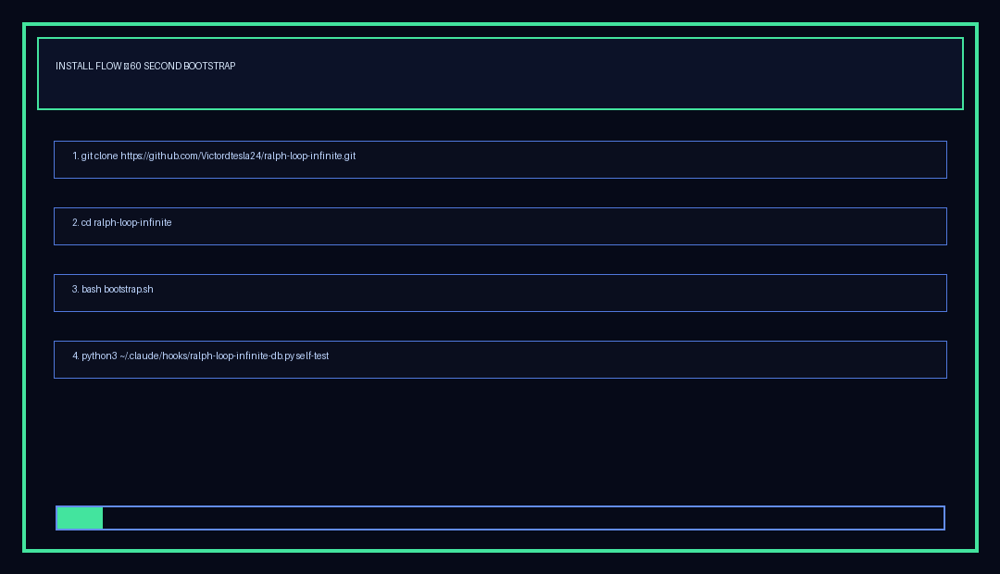
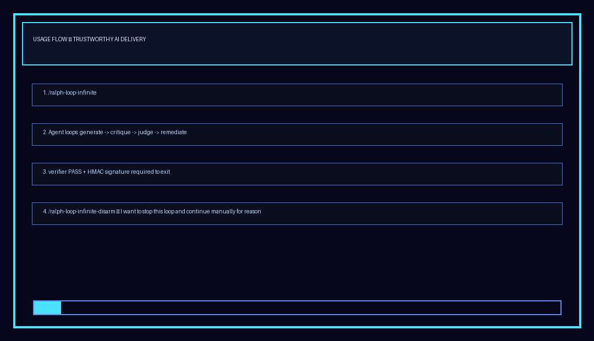

<div align="center">

# RALPH Loop Infinite

### Validation-first autonomous delivery with enforced verifier gating

[](#how-exit-works)
[](#convergence-modes)
[](#validation--quality-gates)
[](#install-in-60-seconds)

</div>

---

## Why this exists

Most agent loops fail at the same point: weak exit semantics.

RALPH Loop Infinite enforces one hard contract:

- work can iterate forever
- quality must be evidenced
- exit only happens on **independent verifier PASS with valid HMAC signature**

No user-typed approval phrase can bypass that gate.

---

## At a glance

| Pillar | What you get |
|---|---|
| Exit contract | HMAC-signed verifier PASS only |
| Judge model policy | Primary + explicit fallback policy |
| Validation | Evidence precheck + structured scoring |
| Observability | Normalized event envelope + correlation IDs |
| Convergence | `strict` by default, optional `blog-compatible` return mode |
| Runtime hardening | Typed stage artifacts + per-role content validation |

---

## Interactive test visualizations (HTML5 + Three.js)

Dynamic, colorful, browser-based loop simulation:

- file: `assets/visuals/loop-visualization.html`
- rendering: HTML5 canvas + Three.js scene graph
- includes: live stage playback, strict/blog-compatible toggles, score bars, verifier gate states

Open locally:

```bash
python3 -m http.server 8080
# then open http://localhost:8080/assets/visuals/loop-visualization.html
```

Static flow contract:

```text
User invokes /ralph-loop-infinite
          |
          v
  GENERATE -> CRITIQUE -> JUDGE -> REMEDIATE
                    |         |
                    |         +--> decision=revise -> continue
                    |
                    +--> decision=accept + HMAC PASS -> exit
```

---

## Install in 60 seconds

### GIF walkthrough



### 1) Clone + bootstrap

```bash
git clone https://github.com/Victordtesla24/ralph-loop-infinite.git
cd ralph-loop-infinite
bash bootstrap.sh
```

### 2) Ensure runtime dependencies

- `python3`
- `bash`
- `jq`

### 3) Add provider keys

```bash
cat >> ~/.claude/.env.production << 'EOF'
ANTHROPIC_API_KEY=your_key_here
DEEPSEEK_API_KEY=your_key_here
MINIMAX_API_KEY=your_key_here
ZAI_API_KEY=your_key_here
EOF
```

HMAC signing key is managed at:

`~/.claude/secrets/ralph-hmac.key`

---

## Daily usage

### GIF walkthrough



### Arm (explicit only)

```bash
/ralph-loop-infinite
```

Only explicit invocation arms the gate.

### Monitor

```bash
python3 ~/.claude/hooks/ralph-loop-infinite-db.py sessions
python3 ~/.claude/hooks/ralph-loop-infinite-db.py events
python3 ~/.claude/hooks/ralph-loop-infinite-db.py state-get verifier_last_verdict
```

### Run harness

```bash
bash ~/.claude/hooks/test-ralph-refactor.sh
```

### Disarm (manual user action)

```bash
/ralph-loop-infinite-disarm — I want to stop this loop and continue manually for <reason>
```

- Requires user-issued command
- Requires reason
- Agent cannot self-disarm

---

## How exit works

```text
Allowed exit:
  verifier verdict PASS
  + valid HMAC signature
  + policy/model allowed
  + pass TTL valid

Everything else:
  keep iterating (or controlled convergence return if explicitly enabled)
```

---

## Convergence modes

| Mode | Behavior |
|---|---|
| `strict` (default) | convergence triggers escalation/remediation; no return without PASS |
| `blog-compatible` | convergence can return current output without PASS when enabled |

Check active mode:

```bash
python3 ~/.claude/hooks/ralph-loop-infinite-policy.py convergence-mode
```

Override locally:

```json
{
  "_ralphLoopInfiniteExitPolicy": {
    "verifier_policy": {
      "convergence_mode": "blog-compatible"
    }
  }
}
```

---

## Validation & quality gates

### Core checks

- Per-dimension scoring (completeness, correctness, clarity, depth, actionability)
- Evidence precheck before verifier signing
- Typed stage artifact enforcement for required roles
- Per-role minimal content checks:
  - orchestrator: plan/steps
  - coder: changed_files/patches/diff
  - tester: test_results/tests/verification
- Offline fallback is fail-closed (`revise`) and requires corroboration signals

### Self-tests

```bash
python3 ~/.claude/hooks/ralph-loop-infinite-db.py self-test
python3 ~/.claude/hooks/ralph-loop-infinite-evidence.py self-test
python3 ~/.claude/hooks/ralph-loop-infinite-ralph.py self-test
bash ~/.claude/hooks/test-ralph-refactor.sh
```

Expected harness signal:

- `PASS: 29  FAIL: 0`

Real value in AI agentic software development:

- strict mode gives reliable production handoff only on verifier-signed PASS
- role-content checks prevent empty orchestrator/coder/tester artifacts
- corroborated offline fallback reduces false-positive acceptance
- correlation IDs unify stop/verifier/stage events for fast incident traceability

---

## Observability

Event data is normalized with a single envelope schema and correlation IDs for tracing:

- schema: `ralph.event.v1`
- fields: `ts`, `hook`, `session_id`, `event_type`, `correlation_id`, `payload`

Sources include:

- stop hook events
- verifier hook events
- ralph stage transitions/logs

---

## Repo map

```text
hooks/
  ralph-loop-infinite-stop.sh
  ralph-loop-infinite-verifier.sh
  ralph-loop-infinite-ralph.py
  ralph-loop-infinite-policy.py
  ralph-loop-infinite-evidence.py
  ralph-loop-infinite-db.py
  ralph-loop-infinite-generator.py
  test-ralph-refactor.sh

scripts/
  sync-ralph-config.sh
  install-sub-agents-to-root.sh
```

---

## Operator quick reference

```bash
# Current policy
python3 ~/.claude/hooks/ralph-loop-infinite-policy.py current

# Current convergence mode
python3 ~/.claude/hooks/ralph-loop-infinite-policy.py convergence-mode

# DB events
python3 ~/.claude/hooks/ralph-loop-infinite-db.py events

# Full harness
bash ~/.claude/hooks/test-ralph-refactor.sh
```

---

## Security posture

- fail-closed where verifier integrity is uncertain
- HMAC verification on verdicts
- policy-checked provider/model lineage
- deterministic evidence-first validation paths

---

<div align="center">

**RALPH Loop Infinite**

Structured iteration. Verifiable quality. Controlled exit.

</div>
